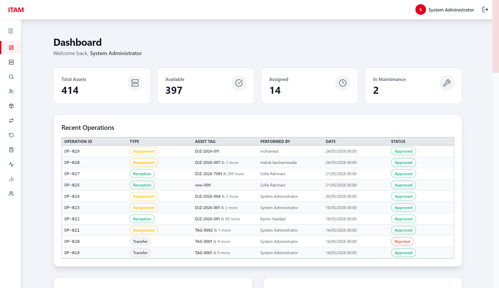
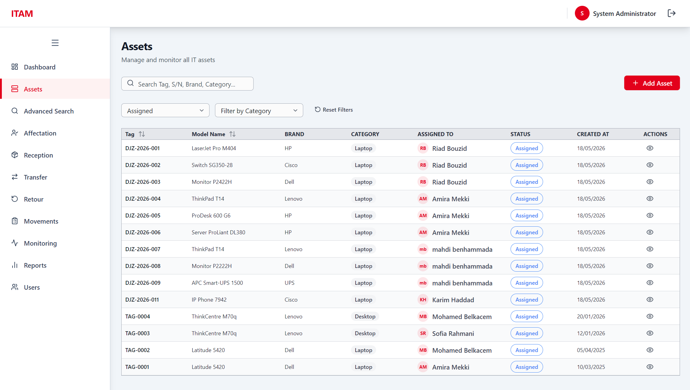
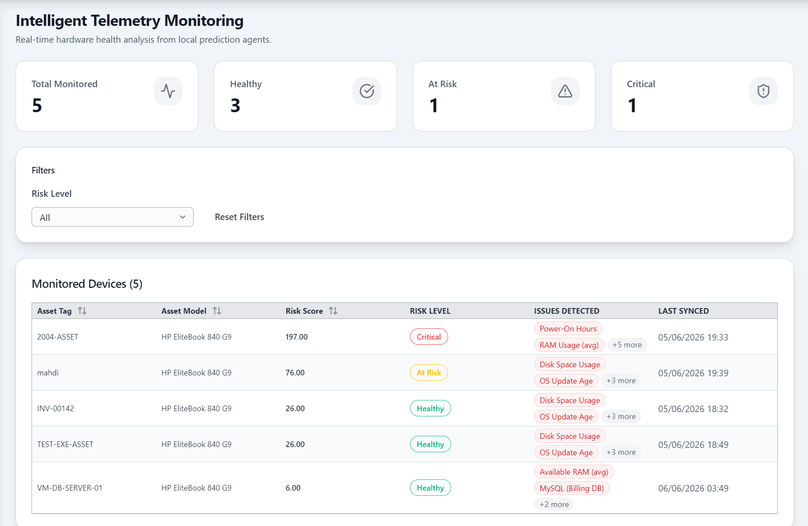
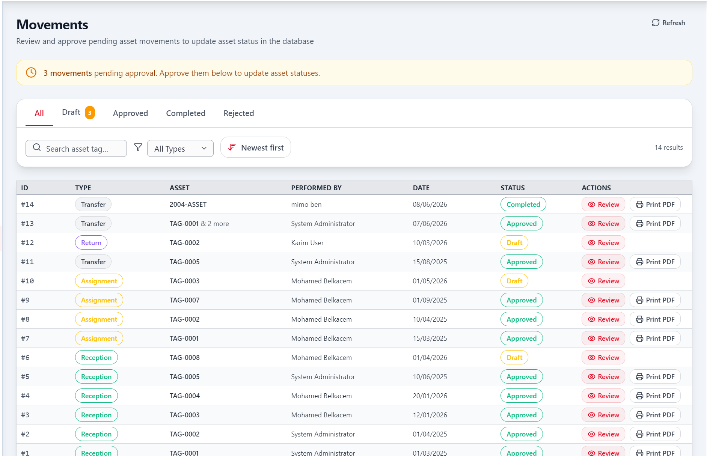
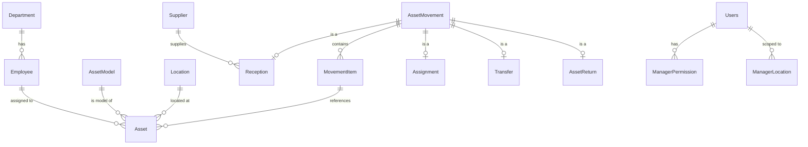

<div align="center">
  <br/>
  
  
  
  
  
  
  

  <br/>
  <h1>📦 ITAM — IT Asset Manager</h1>
  <p><strong>A full-stack IT asset management system with predictive maintenance for telecom environments</strong></p>

  <br/>

  <!-- Screenshot placeholder — replace with your actual screenshots -->
  

  <br/><br/>
  <sub><i>Replace the placeholder image with actual screenshots of your app</i></sub>
</div>

<br/>

---

## ✨ Features

<table>
<tr>
<td width="50%">

### 🖥️ Asset Lifecycle
- **Reception** — Record new asset arrivals with supplier & PO info
- **Assignment** — Assign assets to employees with full traceability
- **Transfer** — Move assets between locations (sites, warehouses, offices)
- **Return** — Process returns with reason tracking
- **Full movement history** per asset with timeline view

</td>
<td width="50%">

### 🔮 Predictive Maintenance
- **AI-driven health scoring** — Rule-based engine evaluates device risk
- **Risk levels** — Healthy · Watch · At Risk · Critical
- **Triggered rules** — See exactly which conditions flagged a device
- **Recommended actions** — Actionable maintenance suggestions

</td>
</tr>
<tr>
<td>

### 👥 Role-Based Access
- **Admin** — Full control: users, permissions, all CRUD
- **Manager** — Granular permissions per operation + location scoping
- **User** — View-only consultation
- **Registration workflow** — Approve/reject pending accounts

</td>
<td>

### 📊 Monitoring & Reporting
- **Live dashboard** — KPIs, recent operations, priority alerts
- **Telemetry monitoring** — Real-time device health overview
- **Advanced search** — Multi-criteria asset filtering
- **PDF ticket generation** — Downloadable movement tickets

</td>
</tr>
</table>

---

## 🏗️ Architecture

<div align="center">

```
┌─────────────────────────────────────────────────────────────┐
│                     🖥️ CLIENT (React 19)                     │
│  ┌──────────┐ ┌──────────┐ ┌──────────┐ ┌────────────────┐ │
│  │   Pages  │ │Components│ │ Context  │ │   API Client   │ │
│  │ (13 rts) │ │(22 files)│ │ (Auth)   │ │  (api.ts)      │ │
│  └────┬─────┘ └────┬─────┘ └────┬─────┘ └───────┬────────┘ │
│       └────────────┴────────────┴───────────────┘          │
│                         │ HTTP (JWT)                        │
└─────────────────────────┼───────────────────────────────────┘
                          │
┌─────────────────────────┼───────────────────────────────────┐
│                     🖥️ SERVER (Express 5)                    │
│  ┌──────────┐ ┌──────────────┐ ┌──────────┐ ┌───────────┐  │
│  │  Routes  │ │  Controllers │ │ Services │ │Middleware │  │
│  │ (13 fms) │ │   (12 fms)   │ │ (14 fms) │ │(auth/err) │  │
│  └────┬─────┘ └──────┬───────┘ └────┬─────┘ └─────┬─────┘  │
│       └──────────────┴──────────────┴──────────────┘        │
│                         │ MySQL2                            │
└─────────────────────────┼───────────────────────────────────┘
                          │
┌─────────────────────────┼───────────────────────────────────┐
│                     🗄️ MySQL DATABASE                        │
│              13 tables: Department, Supplier, Location,      │
│              AssetModel, Employee, Asset, AssetMovement,     │
│              Reception, Assignment, Transfer, AssetReturn,   │
│              Users, DeviceHealthLabel                        │
└─────────────────────────────────────────────────────────────┘
```

</div>

---

## 🛠️ Tech Stack

<table>
<tr>
<th>Layer</th>
<th>Technology</th>
<th>Purpose</th>
</tr>
<tr>
<td><b>Frontend</b></td>
<td>React 19 · TypeScript 5.9 · Vite 8 · Tailwind CSS 4 · React Router 7</td>
<td>SPA with fast HMR, type safety, utility-first styling, client-side routing</td>
</tr>
<tr>
<td><b>Backend</b></td>
<td>Express 5 · MySQL2 · JWT · bcryptjs · express-validator · morgan</td>
<td>REST API with auth, validation, logging, and DB access</td>
</tr>
<tr>
<td><b>Database</b></td>
<td>MySQL · 13 tables with foreign keys and check constraints</td>
<td>Relational data model with referential integrity</td>
</tr>
<tr>
<td><b>Tooling</b></td>
<td>ESLint · PostCSS · nodemon · PDFKit</td>
<td>Code quality, CSS processing, hot reload, PDF generation</td>
</tr>
</table>

---

## 📁 Project Structure

```
itam/
├── Client/                          # React frontend
│   ├── src/
│   │   ├── main.tsx                 # Entry point
│   │   ├── App.tsx                  # Router + auth shell
│   │   ├── pages/                   # 13 route pages
│   │   ├── components/
│   │   │   └── ui/                  # 18 reusable UI components
│   │   ├── layouts/                 # TopBar, Sidebar, AppShell
│   │   ├── context/                 # AuthContext
│   │   ├── lib/                     # API client (api.ts)
│   │   └── utils/                   # cn(), cva helpers
│   ├── package.json
│   └── vite.config.ts
│
├── Server/                          # Express backend
│   ├── src/
│   │   ├── app.js                   # Express app setup
│   │   ├── routes/                  # 13 route files
│   │   ├── controllers/             # 12 controllers
│   │   ├── services/                # 14 services (business logic)
│   │   ├── middleware/              # auth, errorHandler, validate
│   │   ├── validators/              # 8 input validators
│   │   └── config/                  # DB connection pool
│   ├── schema.sql                   # Full database schema
│   ├── data.sql                     # Seed data
│   └── server.js                    # Server entry point
│
└── README.md
```

---

## 🚀 Getting Started

### Prerequisites

- **Node.js** 18+
- **MySQL** 8+
- **npm**

### 1. Database Setup

```sql
-- Connect to MySQL and run:
SOURCE Server/schema.sql;
SOURCE Server/data.sql;
```

Or run the reset script:

```bash
.\reset_db.bat
```

### 2. Server

```bash
cd Server
cp .env.example .env          # Configure your DB credentials
npm install
npm run dev                    # Starts on http://localhost:3000
```

### 3. Client

```bash
cd Client
npm install
npm run dev                    # Starts on http://localhost:5173
```

---

## 🔌 API Endpoints

| Method | Endpoint | Description | Auth |
|--------|----------|-------------|------|
| POST | `/api/auth/login` | Login | Public |
| GET | `/api/auth/me` | Current user | JWT |
| GET/POST | `/api/assets` | List/Create assets | JWT |
| GET | `/api/assets/stats` | Asset statistics | JWT |
| GET | `/api/assets/:id/history` | Movement history | JWT |
| GET/POST | `/api/movements` | List/Create movements | JWT |
| PATCH | `/api/movements/:id/approve` | Approve movement | JWT |
| GET | `/api/movements/:id/ticket` | Download PDF ticket | JWT |
| GET | `/api/dashboard/summary` | Dashboard stats | JWT |
| GET | `/api/telemetry/labels` | Health labels | JWT |
| POST | `/api/registration/submit` | Register | Public |
| PATCH | `/api/registration/:id/approve` | Approve user | Admin |

<details>
<summary><b>📸 Screenshots</b></summary>
<br/>

> Replace `via.placeholder.com` URLs with your actual screenshots by uploading them to the repo's `screenshots/` folder or using an image hosting service.

<div align="center">

### Dashboard


### Asset List


### Telemetry Monitoring


### Asset Movement Timeline


</div>
</details>

---

## 📊 Database Schema

<div align="center">



</div>

**13 tables**: `Department`, `Supplier`, `Location`, `AssetModel`, `Employee`, `Asset`, `AssetMovement`, `MovementItem`, `Reception`, `Assignment`, `Transfer`, `AssetReturn`, `DeviceHealthLabel`, `Users`, `ManagerPermission`, `ManagerLocation`

---

## 🖌️ Design System

The UI uses a **custom design system** built with `class-variance-authority` and Tailwind CSS:

| Component | Variants | Usage |
|-----------|----------|-------|
| `Button` | primary / secondary / ghost / destructive | All CTAs |
| `Badge` | active / inactive / warning / critical / maintenance / assigned | Status indicators |
| `Table` | sortable, selectable, striped, hoverable | All data lists |
| `Modal` | default / confirm / form | Dialogs & forms |
| `Toast` | info / success / warning / error | Notifications |
| `StatCard` | with/without trend | KPI display |
| `Combobox` | searchable select | Employee/location pickers |

---

## 📝 License

This project is licensed under the MIT License.

---

<div align="center">

**Built with ❤️ using React, Express & MySQL**

⭐ Star this repo if you find it useful!

</div>
