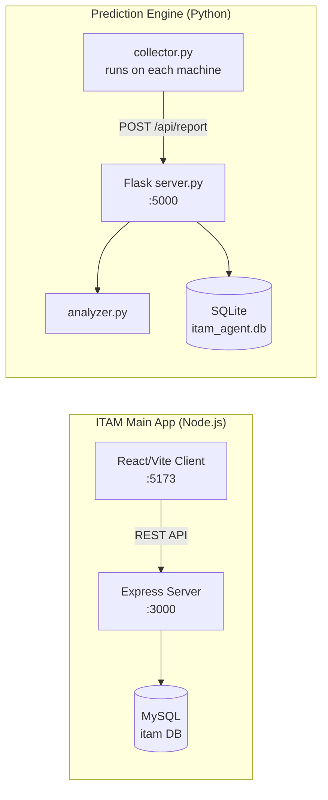
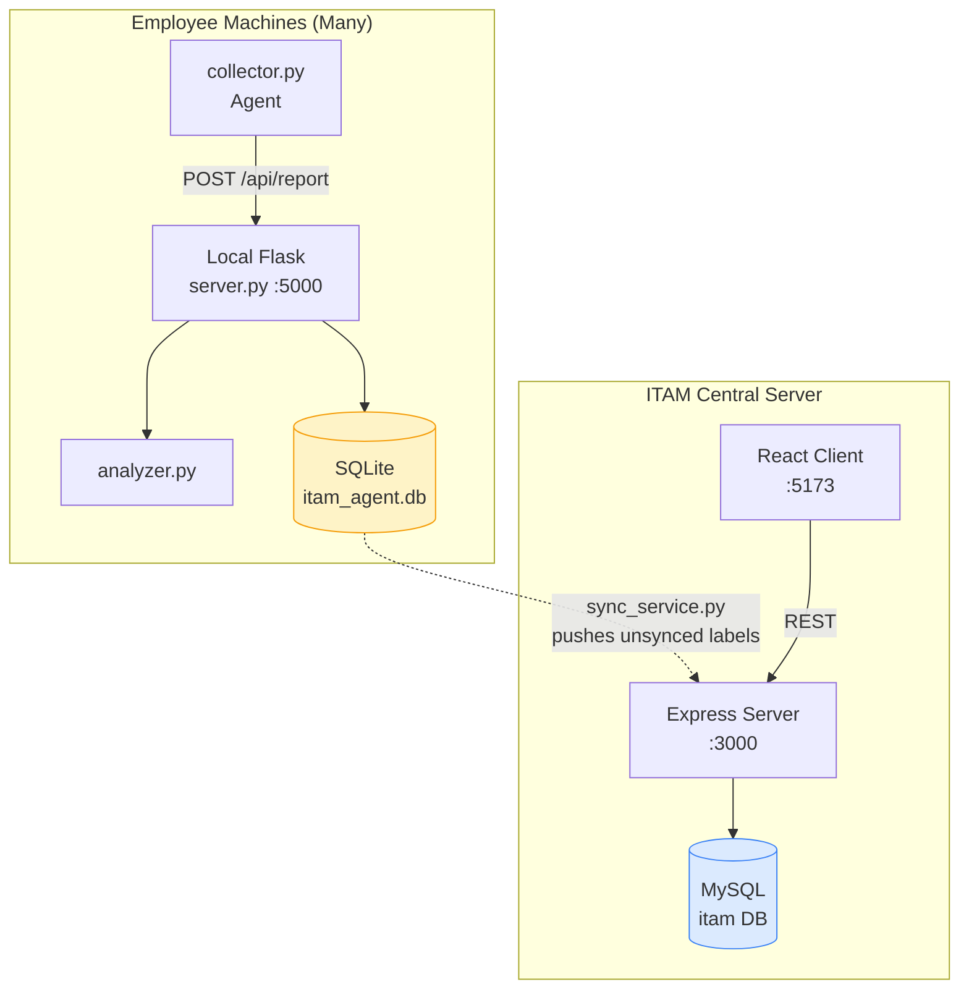
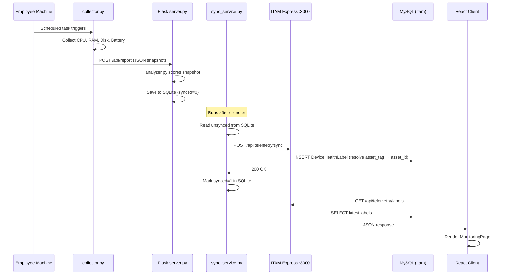

# Integration Plan: Prediction Engine ↔ ITAM Main App

## Updated UML Class Diagram


> The new **DeviceHealthLabel** class (blue) links to **Asset** via `asset_id` — resolved from `asset_tag` during sync. A new **RiskLevel** enumeration is added.

---

## System Overview (Current State)



**The two systems are completely disconnected today.** The ITAM `MonitoringPage` uses only age-based rules from MySQL, while the prediction engine collects real hardware telemetry (CPU, RAM, Disk SMART, Battery) and scores it — but stores everything locally in SQLite and a standalone Flask dashboard.

---

## Target Architecture



> [!IMPORTANT]
> **Key design decision**: The prediction engine stays on local machines (as you described). A lightweight **sync service** periodically pushes scored results from local SQLite → central ITAM MySQL. This avoids requiring every endpoint machine to reach MySQL directly, and works offline.

---

## Phase 1 — MySQL Schema: Add Health Label Table

Add **one** table to the ITAM MySQL database. Raw snapshots stay local in each agent's SQLite — only the scored health labels are synced centrally.

### File: `ITAM/Server/schema.sql` (append)

```sql
-- ============================================================
-- 12. DEVICE HEALTH LABEL  (scored result from prediction agent)
--     Links to Asset via asset_id (resolved from asset_tag on sync)
-- ============================================================

CREATE TABLE DeviceHealthLabel (
    id                 INT AUTO_INCREMENT PRIMARY KEY,
    asset_tag          VARCHAR(100) NOT NULL,
    scored_at          DATETIME     NOT NULL,
    risk_score         DECIMAL(6,2) NOT NULL,
    risk_level         VARCHAR(20)  NOT NULL
                           CHECK (risk_level IN ('Healthy','Watch','At Risk','Critical')),
    triggered_rules    JSON,
    recommended_action TEXT,
    asset_id           INT,
    created_at         TIMESTAMP    DEFAULT CURRENT_TIMESTAMP,
    FOREIGN KEY (asset_id) REFERENCES Asset(id) ON DELETE SET NULL,
    INDEX idx_label_asset_tag (asset_tag),
    INDEX idx_label_risk (risk_level),
    INDEX idx_label_scored (scored_at)
);
```

> [!NOTE]
> **Asset matching on sync**: When the sync service pushes a label, the backend resolves `asset_tag` → `Asset.id` by checking `Asset.tag = ?` first, then falling back to `Asset.serial_number = ?`. This `asset_id` FK is what links telemetry to the rest of the ITAM data model.

### Tasks
| # | Task | File |
|---|------|------|
| 1.1 | Append the `CREATE TABLE` statement to `schema.sql` | `ITAM/Server/schema.sql` |
| 1.2 | Create migration script `add_health_label_table.sql` | `ITAM/Server/migrations/` |
| 1.3 | Run migration against local MySQL | Manual / `reset_db.bat` |

---

## Phase 2 — ITAM Backend: Telemetry API Endpoints

Create new Express routes so the sync service (and the frontend) can read/write telemetry data.

### New files to create

| File | Purpose |
|------|---------|
| `src/services/telemetry.service.js` | MySQL queries for health label CRUD + asset-tag matching |
| `src/controllers/telemetry.controller.js` | Request handling |
| `src/routes/telemetry.routes.js` | Route definitions |

### API Endpoints

| Method | Route | Auth | Purpose |
|--------|-------|------|---------|
| `POST` | `/api/telemetry/sync` | API Key | Bulk insert labels from agent — backend resolves `asset_tag` → `asset_id` |
| `GET` | `/api/telemetry/labels` | JWT | Get latest label per asset, with optional `?risk_level=` filter |
| `GET` | `/api/telemetry/labels/:assetTag` | JWT | Get full label history for one asset |
| `GET` | `/api/telemetry/summary` | JWT | Aggregated stats: count by risk level, assets with no telemetry |

### Register in `app.js`

```js
const telemetryRoutes = require('./routes/telemetry.routes');
app.use('/api/telemetry', telemetryRoutes);
```

### Tasks
| # | Task | File |
|---|------|------|
| 2.1 | Create `telemetry.service.js` with MySQL queries + asset-tag matching | `ITAM/Server/src/services/` |
| 2.2 | Create `telemetry.controller.js` | `ITAM/Server/src/controllers/` |
| 2.3 | Create `telemetry.routes.js` with auth middleware | `ITAM/Server/src/routes/` |
| 2.4 | Register routes in `app.js` | `ITAM/Server/src/app.js` |
| 2.5 | Add `TELEMETRY_API_KEY` to `.env` for sync auth | `ITAM/Server/.env` |

---

## Phase 3 — Sync Service: SQLite → MySQL Bridge

Create a new Python script in the `prediction/` project that reads unsynced rows from the local SQLite database and pushes them to the central ITAM server.

### New file: `prediction/sync_service.py`

```
Flow:
1. Read from SQLite: SELECT * FROM labels WHERE synced = 0
2. POST to ITAM: /api/telemetry/sync  (with API key header)
3. On 200 OK: UPDATE labels SET synced = 1 WHERE id IN (...)
4. Run once after each collection (chained in start.bat)
```

### Key design decisions

- **Auth**: Use a shared API key (`X-Telemetry-Key` header) instead of JWT — the sync service is a machine-to-machine call, not a user session.
- **Batch size**: Send at most 50 rows per request to avoid timeouts.
- **Retry**: On network failure, leave `synced = 0` and try again next cycle.
- **Asset matching**: The `asset_tag` from the collector maps to `Asset.tag` in MySQL. The ITAM backend resolves this to `asset_id` on insert.

### Tasks
| # | Task | File |
|---|------|------|
| 3.1 | Create `sync_service.py` with HTTP push logic (labels only) | `prediction/sync_service.py` |
| 3.2 | Add `ITAM_SERVER_URL` and `ITAM_API_KEY` config vars | `prediction/sync_service.py` |
| 3.3 | Update `start.bat` to run sync after collection | `prediction/start.bat` |

---

## Phase 4 — Collector Enhancement: Smart Asset Tag Matching

Currently, `collector.py` reads the BIOS asset tag or serial number. We need to ensure this matches the `Asset.tag` stored in the ITAM database.

### Options (pick one)

| Option | How it works | Effort |
|--------|-------------|--------|
| **A: Config file** | Create `prediction/agent_config.json` with `{"asset_tag": "INV-00142"}` that overrides BIOS tag | Low |
| **B: Registration endpoint** | On first run, collector calls ITAM API to register/verify its tag | Medium |
| **C: Keep BIOS tag, match in backend** | The ITAM sync endpoint does a fuzzy lookup: `Asset.tag = ? OR Asset.serial_number = ?` | Low |

> [!TIP]
> **Recommended: Option A + C combined.** Let the admin set the correct ITAM tag in a config file when deploying the agent. The backend also does a serial-number fallback match.

### Tasks
| # | Task | File |
|---|------|------|
| 4.1 | Create `agent_config.json` template | `prediction/agent_config.json` |
| 4.2 | Update `collector.py` to read tag from config file first, then BIOS fallback | `prediction/collector.py` |
| 4.3 | Add serial-number fallback matching in `telemetry.service.js` | `ITAM/Server/src/services/telemetry.service.js` |

---

## Phase 5 — Frontend: Real Telemetry in ITAM Dashboard

Replace the current placeholder monitoring page with real data from the prediction engine.

### 5A. Client API Layer

Add telemetry API calls to `api.ts`:

```typescript
// ── Telemetry ────────────────────────────────────────────
export const telemetryApi = {
  getSummary: () => request<TelemetrySummary>('/telemetry/summary'),
  getLabels: (params?: Record<string, string>) => {
    const query = params ? '?' + new URLSearchParams(params).toString() : '';
    return request<DeviceHealthLabel[]>(`/telemetry/labels${query}`);
  },
  getLabelHistory: (assetTag: string) =>
    request<DeviceHealthLabel[]>(`/telemetry/labels/${assetTag}`),
  getLatestSnapshot: (assetTag: string) =>
    request<DeviceSnapshot>(`/telemetry/snapshot/${assetTag}/latest`),
};

export interface DeviceHealthLabel {
  id: number;
  asset_tag: string;
  scored_at: string;
  risk_score: number;
  risk_level: 'Healthy' | 'Watch' | 'At Risk' | 'Critical';
  triggered_rules: TriggeredRule[];
  recommended_action: string;
  asset_id: number | null;
}

export interface TriggeredRule {
  rule_id: string;
  label: string;
  value: any;
  score_contribution: number;
  note: string;
}

export interface DeviceSnapshot {
  asset_tag: string;
  collected_at: string;
  device_type: 'laptop' | 'desktop';
  cpu: { usage_percent: number; temperature_celsius: number | null };
  memory: { usage_percent: number; available_gb: number };
  disks: Array<{
    drive: string;
    usage_percent: number;
    smart_status: string;
    temperature_celsius: number | null;
    wear_percent: number | null;
  }>;
  battery: { health_percent: number | null; cycle_count: number | null; charging_status: string } | null;
  system: { uptime_hours: number; os_version: string | null };
}

export interface TelemetrySummary {
  total_monitored: number;
  healthy: number;
  watch: number;
  at_risk: number;
  critical: number;
  no_telemetry: number;
}
```

### 5B. Revamp `MonitoringPage.tsx`

Replace the current age-based flagging with **real telemetry labels**:

| Section | Data Source | What it shows |
|---------|------------|---------------|
| **KPI Cards** | `GET /telemetry/summary` | Healthy / Watch / At Risk / Critical counts |
| **Asset Health Table** | `GET /telemetry/labels` | All assets with their latest risk score, level, and triggered rules |
| **Asset Detail Drawer** | Click row → expand | Triggered rules breakdown, recommended actions, score history |
| **Rules Panel** | Static + dynamic | Shows the 15+ rules from `analyzer.py` with their thresholds |

### 5C. Dashboard Page Enhancement

Add a "Device Health Overview" widget to `DashboardPage.tsx`:

- Mini donut chart: Healthy vs Watch vs At Risk vs Critical
- Top 5 critical assets list (linked to monitoring page)
- "Last sync" timestamp

### 5D. Asset Detail Enhancement

On `AssetsPage.tsx`, when viewing a single asset, show a **Health tab** with:
- Latest risk score + level badge
- Triggered rules list with score contributions
- Trend chart of risk score over last 30 days (from label history)

### Tasks
| # | Task | File |
|---|------|------|
| 5.1 | Add `telemetryApi` + types to `api.ts` | `ITAM/Client/src/lib/api.ts` |
| 5.2 | Rewrite `MonitoringPage.tsx` with real telemetry labels | `ITAM/Client/src/pages/MonitoringPage.tsx` |
| 5.3 | Add health summary widget to `DashboardPage.tsx` | `ITAM/Client/src/pages/DashboardPage.tsx` |
| 5.4 | Add health tab to asset detail view in `AssetsPage.tsx` | `ITAM/Client/src/pages/AssetsPage.tsx` |

---

## Phase 6 — Deployment & Operational Wiring

### 6A. Agent Deployment Package

Create a self-contained folder that IT admins copy to each machine:

```
prediction-agent/
├── collector.py
├── analyzer.py
├── storage.py
├── server.py
├── sync_service.py
├── agent_config.json      ← admin sets asset_tag here
├── requirements.txt
├── start.bat              ← runs collector + sync in sequence
└── install.bat            ← pip install + scheduled task setup
```

### 6B. Scheduled Collection

Update `start.bat` to run as a Windows Scheduled Task:

```bat
@echo off
cd /d "%~dp0"
python collector.py
python sync_service.py
```

Schedule every 4-8 hours via `schtasks`:
```powershell
schtasks /create /tn "ITAM-Agent" /tr "C:\itam-agent\start.bat" /sc HOURLY /mo 4 /ru SYSTEM
```

### 6C. Update `dashboard.service.js`

Modify `getFlaggedAssets()` to merge age-based rules with real telemetry labels:

```js
// Instead of only age-based flagging, also include assets
// where DeviceHealthLabel.risk_level IN ('At Risk', 'Critical')
```

### Tasks
| # | Task | File |
|---|------|------|
| 6.1 | Create `install.bat` for agent setup on target machines | `prediction/install.bat` |
| 6.2 | Update `start.bat` to chain collector → sync | `prediction/start.bat` |
| 6.3 | Update `getFlaggedAssets()` to include telemetry risk data | `ITAM/Server/src/services/dashboard.service.js` |
| 6.4 | Add `.env.example` with all config variables documented | `ITAM/Server/.env.example` |

---

## Implementation Order

```mermaid
gantt
    title Integration Phases
    dateFormat X
    axisFormat %s

    section Backend
    Phase 1 - MySQL Schema       :p1, 0, 1
    Phase 2 - Express API        :p2, after p1, 2
    
    section Agent
    Phase 3 - Sync Service       :p3, after p2, 2
    Phase 4 - Collector Config   :p4, after p2, 1
    
    section Frontend
    Phase 5 - UI Revamp          :p5, after p2, 3
    
    section Ops
    Phase 6 - Deployment         :p6, after p3, 1
```



> **Phase 1 → Phase 2** must be done first (backend foundation).  
> **Phases 3, 4, 5** can proceed in parallel after Phase 2.  
> **Phase 6** is the final wiring step.

---

## Data Flow (End-to-End)



---

## Summary of New & Modified Files

### New Files (8)
| File | Project | Description |
|------|---------|-------------|
| `migrations/add_health_label_table.sql` | ITAM/Server | MySQL migration (1 table) |
| `src/services/telemetry.service.js` | ITAM/Server | Health label DB queries + asset-tag matching |
| `src/controllers/telemetry.controller.js` | ITAM/Server | Request handlers |
| `src/routes/telemetry.routes.js` | ITAM/Server | Route definitions |
| `sync_service.py` | prediction | SQLite labels → MySQL sync |
| `agent_config.json` | prediction | Per-machine config |
| `install.bat` | prediction | Agent installer |
| `.env.example` | ITAM/Server | Config documentation |

### Modified Files (9)
| File | Project | Change |
|------|---------|--------|
| `schema.sql` | ITAM/Server | Add `DeviceHealthLabel` table |
| `src/app.js` | ITAM/Server | Register telemetry routes |
| `.env` | ITAM/Server | Add `TELEMETRY_API_KEY` |
| `dashboard.service.js` | ITAM/Server | Merge telemetry into flagged assets |
| `api.ts` | ITAM/Client | Add `telemetryApi` + types |
| `MonitoringPage.tsx` | ITAM/Client | Full rewrite with real telemetry |
| `DashboardPage.tsx` | ITAM/Client | Add health summary widget |
| `collector.py` | prediction | Read from `agent_config.json` |
| `start.bat` | prediction | Chain collector → sync |
